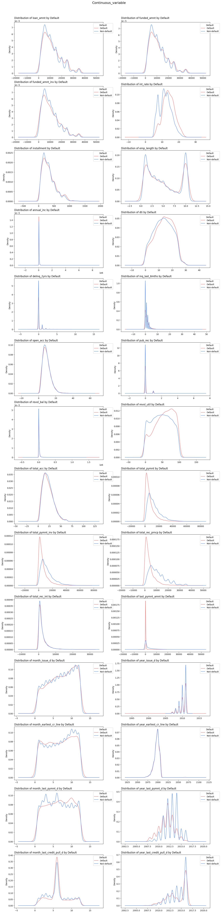
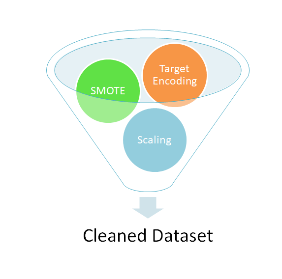

# Loan_default_rate_project

## Project Goal

* Anonymized Loan Default data includes 37 variables such as loan amount, term, interest rate, installment, employment length, home ownership, annual income, loan status, and purpose, among others.

* Loan default is a critical problem because it causes direct financial losses for lenders, as well as liquidity issues and operational disruptions. Therefore, predictive models must be developed to *help prevent these issues.

## Project Workflow

## Exploratory Data Analysis

### EDA1

* Classes are highly imbalanced - Only 14% of total customers failed to repay.

### EDA2

 

#### Key Findings

* Most customers rent or own homes under a mortgage, and about half of them failed to repay their debt.
* The main purpose of the loans is debt consolidation. As interest rates have increased, the likelihood of default has also risen.
* Borrowers in California received the largest number of loans among all states, and roughly 50% of them — the highest rate — failed to repay.
* Borrowers with short-term loans (36 months) are more likely to default due to higher interest rates compared to long-term loans and a tighter repayment schedule

### EDA3

#### When does default happen more frequently?

* When interest rates rise above 10%, more customers fail to repay compared to those who do not.
* When the DTI (Debt-to-Income ratio) exceeds 13%, the default rate is higher than the non-default rate.
* When the revolving credit line utilization exceeds 50%, the default rate surpasses the non-default rate.

## Feature Engineering

### * Target Encoding on state variables -> SMOTE for imbalanced default class -> Scaling for Logistic Regression

## Model Development 

## Feature importance 

#### There are some important features that contribute most to default rate.

* Total_rec_prncp (Principal received to date) : Borrowers who paid back more principal are less likely to default
* Funded_amnt(The total amount committed by investors for that loan at that point in time): Larger loans increase the chance of default.
* Last_pymnt_amnt (Last payment amount): A large most recent payment is a good sign
* Total_rec_int (Total interest received): People who have paid more interest (consistent payments) are less risky.

* ## Conclusion

* ### In conclusion, six models were developed to predict the default rate. When XGBoost model was fine-tuned with the best parameters ({'colsample_bytree': 1.0, 'learning_rate': 0.2, 'max_depth': 5, 'n_estimators': 100, 'subsample': 0.8}), it achieved the best performance across all four metrics — accuracy, precision, recall, and F1 score. Feature engineering also helped XGBoost model in terms of SMOTE, target, and one-hot encoding. As a result, XGBoost model predicts default rate with nearly 99% accuracy, demonstrating a moderate trade-off between precision and recall.

